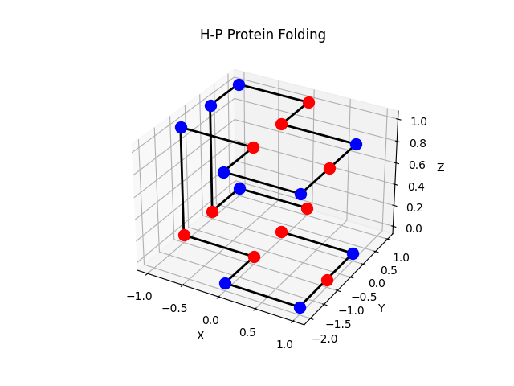
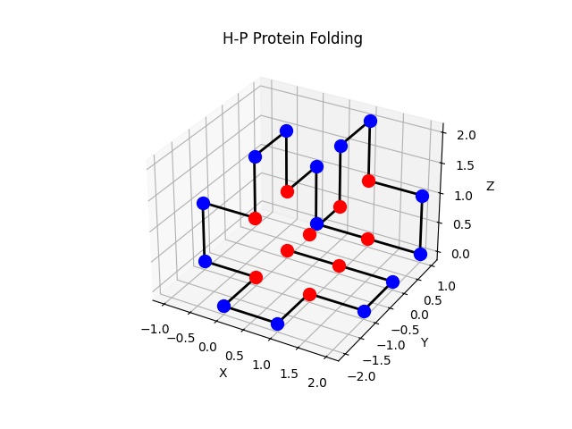
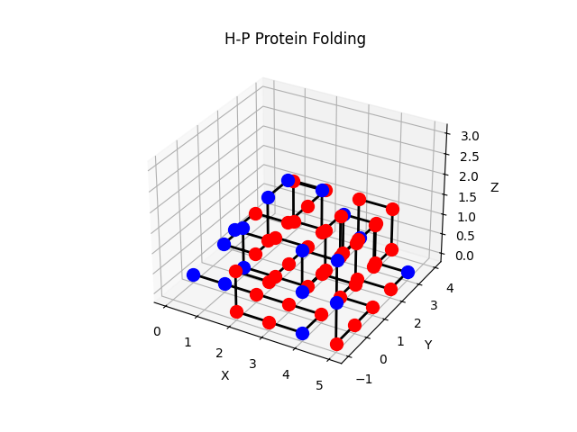
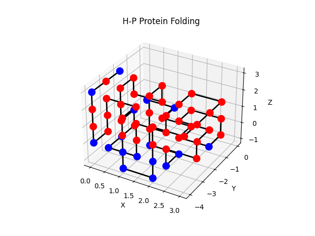

# Enhancing Reinforcement Learning in 3-Dimensional Hydrophobic-Polar Protein Folding Model with Attention-Based Layers

This repository contains the implementation and experimental results for the paper **"Enhancing Reinforcement Learning in 3-Dimensional Hydrophobic-Polar Protein Folding Model with Attention-Based Layers"**. The study explores the use of attention-based mechanisms to improve reinforcement learning strategies for solving the HP protein folding problem in 3D.

---

## Repository Structure
- **`Attn_DQN_3d_hp.py`**  
  This file contains the implementation of the attention-enhanced Deep Q-Network (DQN) used in the experiments.  
  **Note:** Parameters, including the protein sequence, need to be adjusted directly within the script as there is currently no command-line interface.  

- **`Best_Runs/`**  
  This folder contains:
  - **Training Logs:** Detailed logs for all training sessions.
  - **Best Results:** Optimal solutions. These results include all the best solutions (with identical energies but varying structures) in the `best_result/` subfolder. Coordinates are saved in `best_result/best_results_log.csv`

---

## Sample Best Results
Here are some examples of the best results obtained during the experiments:


### Length: 20, Energy = -11


### Length: 24, Energy = -13


### Length: 60, Energy = -49 


### Length: 60, Energy = -49 (Alternative Structure)


---

Install the dependencies using:

```bash
  pip install -r requirements.txt

